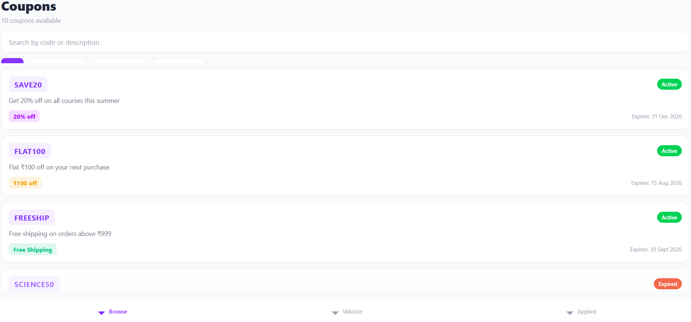
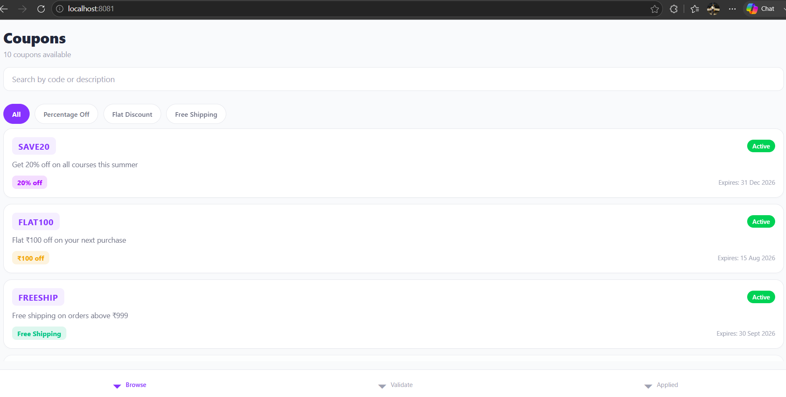
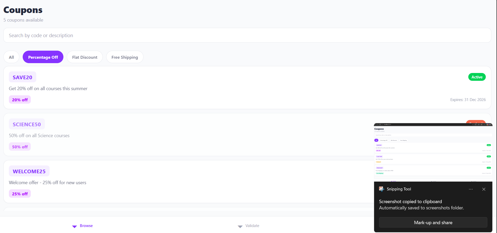
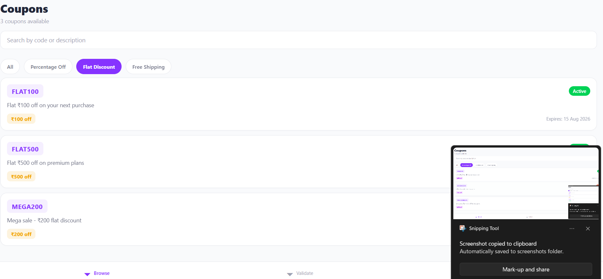
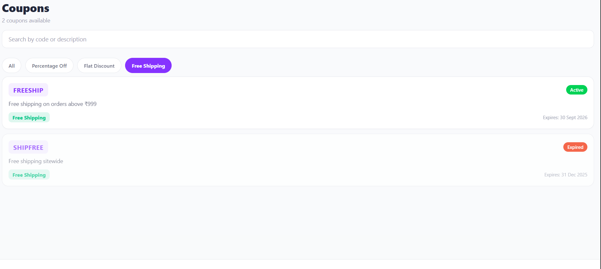
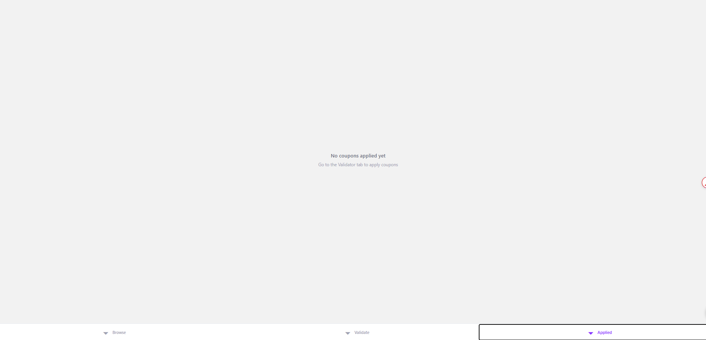

# Coupon Engine App

A React Native coupon management application built with Expo. Users can browse, search, filter, validate, and manage discount coupons in a shopping/edtech context.

## Screenshots

> Add screenshots here after running the app

## Setup Instructions

### Prerequisites

- **Node.js** (v18 or higher) - [Download here](https://nodejs.org/)
- **npm** (comes with Node.js) or **yarn**
- **Expo CLI** - Install globally: `npm install -g expo-cli`
- **Expo Go app** on your phone (from App Store / Play Store) - *for physical device testing*
- **Android Studio** or **Xcode** - *for emulator/simulator testing*

### Step-by-Step Setup

1. **Clone or extract the project**
   ```bash
   cd coupon-engine-app
   ```

2. **Install dependencies**
   ```bash
   npm install
   ```
   > This downloads all required packages listed in `package.json`.

3. **Start the development server**
   ```bash
   npx expo start
   ```
   > A QR code will appear in your terminal. Scan it with the **Expo Go** app on your phone to run the app instantly.

4. **Run on emulator/simulator**
   ```bash
   # iOS Simulator (macOS only)
   npx expo start --ios

   # Android Emulator
   npx expo start --android
   ```

5. **Run on web browser**
   ```bash
   npx expo start --web
   ```

### Troubleshooting

| Issue | Solution |
|-------|----------|
| `command not found: expo` | Run `npm install -g expo-cli` |
| Metro bundler fails | Clear cache: `npx expo start -c` |
| iOS build fails | Ensure Xcode is installed and updated |
| Android build fails | Ensure Android Studio + SDK is configured |
| Port 8081 already in use | Kill process or use: `npx expo start --port 8082` |

---

## Architecture & Design Decisions

### Project Structure

```
src/
├── components/     # Reusable UI pieces (CouponCard, SearchBar, FilterChips, etc.)
├── screens/        # One screen per feature (List, Detail, Validator, Applied)
├── navigation/     # React Navigation configuration (Stack + Bottom Tabs)
├── services/       # API layer - mock data with setTimeout simulation
├── context/        # React Context for global state (coupons, applied coupons, filters)
├── utils/          # Pure functions: validation, formatting, calculations
├── types/          # TypeScript interfaces and type aliases
└── constants/      # Colors, labels, config values
```

**Why this structure?**
- **Separation of concerns**: UI, logic, and data are cleanly separated
- **Scalability**: Easy to add new screens, components, or services
- **Testability**: Pure utility functions and isolated components are easy to unit test
- **Maintainability**: New developers can find anything in seconds

### Where Validation Logic Lives

All coupon validation logic is in `src/utils/validation.ts` as **pure functions**.

**Why separate it?**
1. **Testability**: No React hooks, no side effects — just input → output. Easy to write unit tests.
2. **Reusability**: Used in both `CouponValidatorScreen` and `CouponDetailScreen` (for status checks).
3. **Predictability**: Same inputs always produce the same output. No hidden state bugs.
4. **Server parity**: If we later add a real backend, these same validation rules can be ported to Node.js with zero changes.

Validation checks performed:
- Code existence (invalid code → error)
- Expiry date comparison (expired → error)
- Minimum order value check (cart too low → error)
- Duplicate application prevention (already applied → error)

### Server-Side Validation (Design Thinking)

If a real backend existed, I would handle it like this:

1. **Double-validation**: Client-side for instant UX feedback, server-side for security. Never trust client validation alone.
2. **Rate limiting**: Prevent brute-force coupon guessing (e.g., max 5 attempts per minute per IP).
3. **Atomic apply operation**: Use database transactions to prevent race conditions when multiple users try to apply the same limited-use coupon simultaneously.
4. **Idempotency keys**: Send a unique key with each validation request. If the network fails and the client retries, the server recognizes the duplicate and returns the same result instead of double-applying.
5. **Real-time sync**: Use WebSockets or Server-Sent Events to push coupon status changes (e.g., "coupon just expired") to active sessions.
6. **Coupon state machine**: Track coupon lifecycle (active → applied → redeemed → expired) server-side to prevent abuse.

---

## AI-Assisted Development

### Tools Used
- **Cursor IDE** - Primary code generation, refactoring, and architecture suggestions
- **GitHub Copilot** - Inline autocomplete for boilerplate code

### Example Prompts Used

1. *"Generate a React Native bottom tab navigator with three screens using React Navigation v6 and TypeScript"*
2. *"Create a pure validation function that checks coupon expiry, minimum order value, and duplicate application. Return a typed ValidationResult object"*
3. *"Write a reusable CouponCard component with TypeScript props for a Coupon object, including status badge and discount formatting"*
4. *"Set up a React Context provider for managing coupon state with loading, error, filter, and applied coupons"*
5. *"Design a mock API service with setTimeout simulation that returns 10 diverse coupons (active/expired, percentage/flat/free_shipping)"*

### Where AI Helped Most
- **Boilerplate reduction**: Navigation setup, context providers, basic component scaffolding
- **TypeScript types**: Generating comprehensive interfaces from requirements
- **Styling patterns**: Consistent design system with color tokens and spacing
- **Mock data generation**: Creating realistic, diverse test data quickly

### What Was Manually Corrected or Implemented

| Area | AI Generated | Manual Fix |
|------|-------------|------------|
| Validation edge cases | Basic expiry check | Added `free_shipping` handling (discount amount = 0) |
| State management | Simple context | Added `filteredCoupons` computed state to prevent re-renders |
| Error handling | Generic error message | Added specific error codes (`INVALID_CODE`, `EXPIRED`, etc.) |
| UI/UX | Basic card layout | Added loading skeletons, empty states, pull-to-refresh |
| Navigation | Standard tab setup | Added Stack Navigator inside Browse tab for detail push |
| Accessibility | None | Ensured minimum 44px touch targets, proper color contrast |
| SafeArea handling | Basic View | Added SafeAreaView with insets for notch phones |
| Filter chips scroll | Basic ScrollView | Fixed text overflow and proper horizontal scroll |

### How Correctness Was Validated
- **Manual testing**: All 10 mock coupons tested with various cart totals
- **Edge cases**: Empty search, invalid codes, expired coupons, minimum order failures
- **State flow**: Verified applied coupons persist in session, remove works correctly
- **Cross-screen**: Confirmed navigation between List → Detail → Validator → Applied works smoothly
- **Responsive**: Tested on web browser and mobile viewport

---

## Features

| Feature | Description |
|---------|-------------|
| **Browse Coupons** | List all coupons with search by code/description |
| **Filter by Type** | Percentage Off / Flat Discount / Free Shipping |
| **Coupon Details** | Full info with Copy to Clipboard button |
| **Validate Coupon** | Check code + cart total against mock rules |
| **Applied Coupons** | Session-based list with remove option |
| **Loading States** | Skeleton shimmer during API fetch |
| **Error Handling** | Clear messages for API failures and invalid inputs |
| **Empty States** | Friendly UI when no coupons match filters |

---

## Tech Stack

- React Native 0.76
- Expo SDK 52
- TypeScript
- React Navigation v7 (Bottom Tabs + Native Stack)
- React Context (state management)
- Expo Clipboard

---

## License

MIT
## Screenshots

### 1. Browse Coupons - All Coupons


### 2. Filter by Type - Flat Discount Selected


### 3. Search Coupons - SAVE20


### 4. Coupon Detail - Full Details


### 5. Validate Coupon - Success


### 6. Applied Coupons


## Demo Video

[Click to Watch Demo](screenshots/demo-video.mp4)